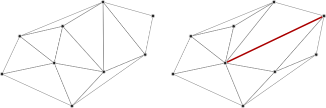
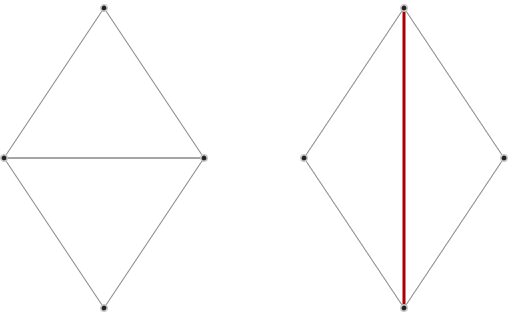

Constrainautor
==============

A library for constraining triangulations from [Delaunator](https://github.com/mapbox/delaunator).

Example
-------

Constrainautor takes a Delaunay triangulation (from Delaunator), and turns it
into a *constrained* (but not necessarily *conforming*) triangulation. You
specify two points in the triangulation, and Constrainautor ensures there is an
edge between those points.

	// A diamond
	const points = [[150, 50], [50, 200], [150, 350], [250, 200]],
		// Creates a horizontal edge in the middle
		del = Delaunator.from(points),
		con = new Constrainautor(del);
	
	// .. but we want a vertical edge, from [150, 50] to [150, 350]:
	con.constrainOne(0, 2);
	// del now has the constrained triangulation, in the same format that
	// Delaunator outputs

Install
-------

Install from NPM:

	npm install @kninnug/constrainautor
	
Use in Node.js:

	const Constrainautor = require('@kninnug/constrainautor');
	
or as an ECMAScript/ES6 module:

	import Constrainautor from '@kninnug/constrainautor';

or in the browser:

	

or minified:

	

The Constrainautor library does not depend on Delaunator itself, but the input
is expected to be in the format that Delaunator outputs. The ES module variant
(`lib/Constrainautor.mjs`) depends on
[robust-predicates](https://www.npmjs.com/package/robust-predicates), but the
CommonJS and minified versions (`lib/Constrainautor.cjs` and `lib/Constrainautor.min.js`)
come with this dependency compiled in, and can be used standalone. The (source) 
TypeScript version is in `Constrainautor.ts`.

Usage
-----

Besides being in the format that Delaunator outputs, the library has these other
requirements on the input data:

- Points are not duplicated, i.e. no two points have the same x and y coordinates.
- No two constrained edges intersect with eachother.
- Constrained edges do not intersect with any point in the triangulation (beside
  their end-points).
- The outer edges of the triangulation form a convex hull.
- The triangulation has no holes.

The last two requirements are already guaranteed by Delaunator, but are 
important to keep in mind if you modify the triangulation before passing it to
Constrainautor. If one or more of these requirements are not met, the library
may throw an error during constrainment, or produce bogus results.
  
To triangulate a set of points, and constrain certain edges:

1. Define the points to be triangulated: `points = [[x1, y1], [x2, y2], ...]`.
2. Define the edges to be constrained: `edges = [[0, 1], [3, 4], ...]`. These are
   indices into the `points` array.
3. Generate a triangulation (using Delaunator): `del = Delaunator.from(points)`.
4. Make a constrainer: `con = new Constrainautor(del)`. Note that `del` will be
   modified by the Constrainautor methods.
5. Constrain the triangulation: `for(const [p1, p2] of edges){ con.constrainOne(p1, p2); }`.

Alternatively, you can call `con.constrainAll(edges)`, which will constrain all
the edges in the supplied array. Or, (since version 4.0.0), call 
`new Constrainautor(del, edges)` with the Delaunator output *and* the edges 
array to create the Constrainautor and constrain the edges in one go.

You can then use the triangulation in `del` as described in the [Delaunator
guide](https://mapbox.github.io/delaunator/).

If you change the point coordinates and their triangulation (via `Delaunator#update`),
you need to re-constrain the edges by creating a `new Constrainautor` and going
through steps 3 - 5 again.

API reference
-------------

More details can be found in the comments of `Constrainautor.ts`.

### con = new Constrainautor(del[, edges])

Construct a new Constrainautor from the given triangulation. The `del` object
should be returned from Delaunator, and is modified in-place by the 
Constrainautor methods. If `edges` is provided, it will constrain those with
`constrainAll`.

#### con.constrainOne(p1, p2)

Constrain an edge in the triangulation. The arguments `p1` and `p2` must be
indices into the `points` array originally supplied to the Delaunator. It 
returns the id of the half-edge that points from `p1` to `p2`, or the negative
id of the half-edge that points from `p2` to `p1`. Note: this half-edge id is
only valid up to the next call to `constrainOne`, after which the constrained
edge will still be there, but may have a different id.

#### con.delaunify([deep = false])

Check non-constrained edges if they satisfy the Delaunay condition (for every
two triangles sharing an edge, neither lies completely within the circumcircle
of the other), and flip the edge if they don't. If `deep` is `true`, it will
check & correct until all flipped edges satisfy the condition, otherwise it will
do only one pass and some edges may still not be Delaunay. 
NB 1: since version 4.0.0 it is no longer necessary (or useful) to call this 
method after constraining edges, since `constrainOne` will also do it.
NB 2: since version 4.0.0 this method returns `this` instead of `this.del`.

#### con.constrainAll(edges)

A shortcut to constraining an array of edges by `constrainOne`. The argument 
`edges` must be an array of arrays of indices into the `points` array originally
supplied to Delaunator, i.e: `[[p1, p2], [p3, p4], ...]`. Returns `this`.
NB: since version 4.0.0 this method returns the `Constrainautor` instance,
instead of the Delaunator object.

#### con.isConstrained(edg)

Whether the half-edge with the given id is a constraint edge. Returns true if
`edg` was earlier returned by a call to `constrainOne`. Note: this doesn't try
to detect if the edge must be a constraint, merely that it has been marked as
such by the `Constrainautor` instance.

#### con.findEdge(p1, p2)

Find the id of the half-edge going from `p1` to `p2`. If there is only an edge 
from `p2` to `p1` (i.e. it is on the hull), it will return the negated id. If
there is no edge between `p1` and `p2`, the return value is `Infinity`.

#### con.del

The Delaunator object passed to the constructor and modified by constraining.

Details
-------

At construction time, the Constrainautor library allocates one Uint32Array, and
two BitSet arrays, in addition to the arrays already present in the Delaunator 
output:

- `vertMap`: a mapping of each point (vertex) in the triangulation to the (id of
  the) left-most edge that points to that vertex. This is used to find the edges
  connected to any given point.
- `flips`: keeps track of the edges that were flipped. It is used to determine 
  which edges may need to be flipped again to restore the Delaunay condition.
- `consd`: keeps track of the edges that are constrained. It is used to ensure
  those edges are not flipped during re-Delaunifying.

(These should be considered private, and may disappear in a later version.)
  
During the constraining process, or the re-Delaunayfying, the library does no 
dynamic allocations. Rather, it sets `flips` to 1 at the index of each edge that
was flipped, and iterates over this set afterwards to check the Delaunay 
condition and flip the flipped edges again if needed.

The library uses robust geometric predicates from
[robust-predicates](https://github.com/mourner/robust-predicates) and
[robust-segment-intersect](https://github.com/mikolalysenko/robust-segment-intersect),
and should not break on smallish inputs. This can be changed by extending the
class and overriding the `intersectSegments`, `inCircle`, and `isCollinear`
methods. See the comments in `Constrainautor.ts` on how they should behave.

Changes
-------

### 4.0.0
- Add `edges` parameter to constructor for one-shot constructing & constraining.
- Change return value of `delaunify` and `constrainAll` to return the 
  `Constrainautor` instance (the Delaunator output is still modified in place,
  and available at `con.del`).
- Fix issue [#4](https://github.com/kninnug/Constrainautor/issues/4) by
  restoring the Delaunay condition immediately at the end of `constrainOne`.
  Due to this, calling `delaunify` manually is no longer necessary.
- Add `findEdge` method.
- Remove `full` parameter from `delaunify`: since calling it is no longer a
  necessity, when it is called, it will always check all edges.
- Use 2 BitSets (see `BitSet.ts`) for keeping track of the flips and 
  constraints, instead of 1 flips array.

### 3.0.0
- Convert to TypeScript.
- Move built files to `lib/`.
- Add `full` parameter to `delaunify`.
- Fix Delaunay condition-check in validators.

### 2.1.2
- Fix disappearing constraints.

### 2.1.1
- Fix delaunify not restoring the Delaunay condition for all changed triangle 
  pairs.
- Move test files to separate repository (to share with other libraries).

### 2.1.0
- Add `isConstrained` convenience method.

### 2.0.0
- Fix issue [#2](https://github.com/kninnug/Constrainautor/issues/2) by
  using [robust-predicates](https://github.com/mourner/robust-predicates).
- Remove `intersectSegments`, `inCircle`, and `segPointDistSq` from the API
  documentation.

### 1.0.1
- Add documentation for internal intersect methods, which can be overridden to
  fix robustness issues.
- Mitigate issue [#2](https://github.com/kninnug/Constrainautor/issues/2) by
  throwing when constraining segment leaves the hull.
- Add test files from [Interesting Polygon Archive](https://github.com/LingDong-/interesting-polygon-archive).

### 1.0.0
- Initial version

Attributions
------------

- The constraining algorithm is adapted from [A fast algorithm for generating constrained Delaunay triangulations](https://web.archive.org/web/20210506140628if_/https://www.newcastle.edu.au/__data/assets/pdf_file/0019/22519/23_A-fast-algortithm-for-generating-constrained-Delaunay-triangulations.pdf), 1992, S. W. Sloan.
- Uses Volodymyr Agafonkin's [robust-predicates](https://github.com/mourner/robust-predicates) port
  of Jonathan Shewchuk's [Adaptive Precision Floating-Point Arithmetic and Fast Robust Predicates
  for Computational Geometry](http://www.cs.cmu.edu/~quake/robust.html).
- Robust segment-segment intersection test adapted from Mikola Lysenko's
  [robust-segment-intersect](https://github.com/mikolalysenko/robust-segment-intersect).
